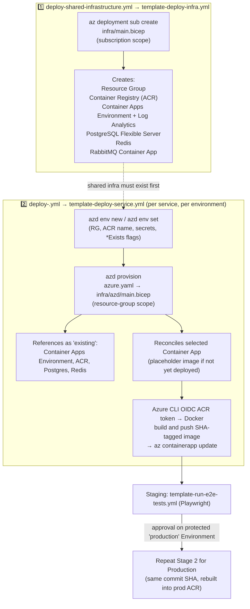

# eShop Azure deployment

This folder deploys the minimal eShop shopping slice with **Bicep**, **GitHub Actions**, and the **Azure Developer CLI (`azd`)** — it does not use Azure DevOps. Shared infrastructure (the resource group, ACR, the Container Apps environment, PostgreSQL, Redis, RabbitMQ) is provisioned by a single subscription-scoped `infra/main.bicep` template through one `az deployment sub create` call. The 5 application Container Apps are provisioned and deployed by `azd`, driven by the root `azure.yaml` and `infra/azd/main.bicep`. Resource modules delegate to version-pinned [Azure Verified Modules (AVM)](https://azure.github.io/Azure-Verified-Modules/) from the public Bicep registry; the local wrappers preserve this deployment's CAF names, low-cost SKUs, and application configuration contract.

## Environments and CAF names

Staging and Production use the same Azure subscription but are isolated in distinct resource groups:

| Environment | CAF code | Resource group | Container registry |
| --- | --- | --- | --- |
| Staging | `stg` | `rg-eshop-stg-swe-001` | `acreshopstgswe001` |
| Production | `prd` | `rg-eshop-prd-swe-001` | `acreshopprdswe001` |

Deployments use the Sweden Central Azure region (`swedencentral`) and the CAF region code `swe`. Names follow the Azure CAF pattern `<resource-abbreviation>-<workload>-<environment>-<region>-<instance>`. Examples include `cae-eshop-stg-swe-001` for the Container Apps environment and `ca-eshop-web-prd-swe-001` for the Production web app. Azure Container Registry names use the same components without separators because ACR permits alphanumeric characters only; registry names must also be globally unique.

## Architecture

Each environment creates its own low-cost resources:

- ACR Basic (`acr`)
- Container Apps Consumption environment (`cae`)
- Log Analytics workspace (`log`)
- PostgreSQL Flexible Server, Burstable `Standard_B1ms`, no high availability (`psql`)
- Azure Managed Redis Balanced B0 (`redis`)
- Internal RabbitMQ Container App (demo-only)
- Public WebApp and Identity API Container Apps
- Internal Basket, Catalog, and Ordering API Container Apps

The application images are built once in Staging, tagged with the full Git commit SHA, and deployed by immutable manifest digest. The Staging workflow produces GitHub-signed SLSA provenance and SPDX SBOM attestations for that digest. After the Staging E2E gate and the protected Production Environment approval, Production imports that exact digest into its own registry and deploys it without rebuilding. The import must preserve the digest; the workflow fails if it changes or if a tag already exists. This gives one verified executable artifact across both environments.

## Application Container Apps: azd

`azure.yaml` declares the 5 application services (`webapp`, `identity-api`, `basket-api`, `catalog-api`, `ordering-api`) as `containerapp`-hosted services and points `infra.path` at `infra/azd`. `infra/azd/main.bicep` is a resource-group-scoped template that:

- References the shared Container Apps environment, ACR, PostgreSQL, and Redis as `existing` resources (it never creates or modifies them).
- Declares all 5 container apps, each tagged `azd-service-name: <service>`, but conditionally reconciles only the service named by `AZD_SERVICE_NAME` during a per-service workflow.
- Uses azd's standard "exists" pattern (`infra/azd/fetch-container-image.bicep` plus a `<service>Exists` parameter) so that re-running `azd provision` never resets a container app's image back to the placeholder — it always preserves whatever image the most recent deployment set.

`template-deploy-service.yml` runs this flow per service, per environment:

1. `azure/login` (OIDC) for plain `az` CLI calls, then install `azd` and `azd auth login --federated-credential-provider github` (also OIDC, no separate credential).
2. Query `az containerapp show` for all 5 expected container app names to compute each `<service>Exists` flag live from the current resource group, and set `AZD_SERVICE_NAME` to the selected service — this is intentionally **not** persisted azd environment state, since CI runners are ephemeral. It self-heals after `purge-test-environments.yml` deletes a resource group: the selected app is detected as not-existing and gets recreated from the placeholder image.
3. `azd env new` recreates a throwaway azd environment every run (never committed — see `.gitignore`) and `azd env set` supplies the resource group, registry, secrets, and exists flags.
4. `azd provision` reconciles the selected container app's Bicep-declared configuration (env vars, secrets, ingress).
5. Azure CLI obtains an OIDC-backed ACR access token, then Docker builds and pushes the immutable-SHA-tagged image in Staging. The workflow resolves its manifest digest, generates GitHub-signed provenance and SPDX SBOM attestations, verifies the provenance, and updates the selected Container App with the digest reference. Production uses `az acr import` to copy that verified digest into its own registry and updates the Container App with the imported digest; it never rebuilds from source.

Although `infra/azd/main.bicep` contains all 5 app declarations, `AZD_SERVICE_NAME` makes each `azd provision` operation reconcile only its selected service. This prevents parallel service workflows from reusing ARM deployment names or modifying sibling app configuration.

## GitHub configuration

Create two GitHub Environments named exactly `staging` and `production`. Store these secrets separately in **each** Environment:

- `AZURE_CLIENT_ID`
- `AZURE_TENANT_ID`
- `AZURE_SUBSCRIPTION_ID`
- `POSTGRES_ADMINISTRATOR_PASSWORD`
- `RABBITMQ_PASSWORD`
- `E2E_USERNAME` (Staging only)
- `E2E_PASSWORD` (Staging only)

The three `AZURE_*` values are intentionally Environment secrets, even though both environments use the same subscription ID. Use separate Entra application registrations or managed identities for Staging and Production so each can receive narrowly-scoped permissions.

Configure an Entra federated credential for each identity with the GitHub repository subject matching its Environment:

- `repo:Xebia-Xpirit-Assessments/assessment-joostvoskuil:environment:staging`
- `repo:Xebia-Xpirit-Assessments/assessment-joostvoskuil:environment:production`

Grant each identity deployment rights only over its corresponding resource group. The Staging identity needs `AcrPush` on its environment registry to publish images. The Production identity needs the minimum read/import permission required to import the Staging image by digest as well as push/import permission on the Production registry; validate the exact built-in roles against the tenant's ACR configuration. Do not use an Azure client secret, publish profile, registry admin account, or subscription-wide Owner role.

Protect the `production` GitHub Environment with required reviewers. Every push to `main`, or manual dispatch, follows the fixed Staging → Production promotion flow. Production proceeds only after Staging succeeds and its required Environment approval is granted. Both stages use the workflow revision’s immutable commit SHA.

## Nightly cost cleanup

`.github/workflows/purge-test-environments.yml` deletes both test resource groups every night at 02:00 UTC:

- `rg-eshop-stg-swe-001`
- `rg-eshop-prd-swe-001`

The workflow uses the `staging` and `production` GitHub Environments independently, so each Azure identity needs delete permission only on its own resource group. It uses OIDC and waits for each deletion to finish. The workflow can also be started manually from the Actions tab. This is intentionally destructive and is appropriate only because these Azure environments are test setup; do not reuse it for real production workloads. Re-running the deployment workflow recreates the required resources.

## Deployment flow

Shared infrastructure and each application service deploy through independent workflows, every one with its own trigger and its own Staging → Production promotion. The three stages always run in this order — each stage depends on resources the previous stage created:

1. `infra/main.bicep` (subscription scope) — creates the resource group, ACR, the shared Container Apps environment, PostgreSQL, Redis, and RabbitMQ, all in one `az deployment sub create` call.
2. `azd provision` (`azure.yaml` → `infra/azd/main.bicep`, resource-group scope) — references the resources from stage 1 as `existing` and reconciles the selected application Container App.
3. Azure CLI obtains an OIDC-backed ACR token; Docker builds and pushes the SHA-tagged image; `az containerapp update` patches that one container app's revision.



1. `ci.yml` runs for pull requests (and pushes) to `main`. It validates Bicep, then fans out to the reusable `template-build-service.yml` template once per service (`webapp`, `identity-api`, `basket-api`, `catalog-api`, `ordering-api`) to build and test only that service's project and its mapped test projects.
2. `deploy-shared-infrastructure.yml` triggers on pushes to `infra/main.bicep` or `infra/modules/**` (or manual dispatch) and calls the reusable `template-deploy-infra.yml`, which owns the resource group, ACR, the Container Apps environment, databases, Redis, and RabbitMQ. It deploys Staging, then Production after the protected Production Environment approval.
3. Each service has its own top-level pipeline — `deploy-webapp.yml`, `deploy-identity-api.yml`, `deploy-basket-api.yml`, `deploy-catalog-api.yml`, `deploy-ordering-api.yml` — triggered only by pushes to that service's own source, its known shared dependencies, `azure.yaml`, `infra/azd/**`, or the shared reusable templates. Documentation, test-only, E2E-only, and local-only changes do not start Azure deployment.
4. Each per-service pipeline runs `template-build-service.yml` (build + test gate), then calls the reusable `template-deploy-service.yml` for Staging. Staging builds the image once, generates and verifies GitHub-signed provenance and an SPDX SBOM attestation, and returns its immutable image digest. The reusable `template-run-e2e-tests.yml` then runs the authenticated Playwright suite against the deployed Staging WebApp. Production receives the Staging digest only after that gate and the protected Environment approval, imports the exact digest into its own ACR, and deploys it without rebuilding. Docker, ACR import, and `az containerapp update` only patch the selected service's Container App, so deploying one service cannot delete or reset its siblings.
5. The shared E2E gate is a hard prerequisite for that pipeline's Production promotion. Because every service's pipeline calls it independently, concurrent pushes to different services each re-verify Staging before promoting. The protected Production Environment then rebuilds the same SHA into the Production registry.

Each `deploy-<service>.yml` also supports manual dispatch for that one service; there is no single "deploy all services" action. `deploy-shared-infrastructure.yml` manual dispatch always redeploys Staging then Production shared infrastructure. After a nightly purge or for first provisioning, run `deploy-shared-infrastructure.yml` first, then dispatch each of the five `deploy-<service>.yml` workflows — `template-deploy-service.yml`'s live `az containerapp show` check detects the missing selected container app and lets `azd provision` recreate it from the placeholder image before the Docker-published image replaces it.

`main.bicep` is subscription-scoped and creates the supplied environment's resource group, ACR, and the rest of the shared resources, each nested module deployed with an explicit `scope: resourceGroup(rg.name)`. `infra/azd/main.bicep` is resource-group-scoped and is owned by `azd`; it declares all 5 application Container Apps, referencing shared resources as `existing`. This prevents a Staging run from changing Production resources, while service-scoped provisioning and `az containerapp update` prevent a service update from owning unrelated revisions.

## Azure Verified Modules

The local modules in `infra/modules/` compose these AVM resource modules:

- `avm/res/container-registry/registry:0.13.0`
- `avm/res/operational-insights/workspace:0.12.0`
- `avm/res/app/managed-environment:0.16.0`
- `avm/res/app/container-app:0.23.0`
- `avm/res/db-for-postgre-sql/flexible-server:0.10.0`
- `avm/res/cache/redis-enterprise:0.5.1`

Versions are deliberately pinned for repeatable deployments. Update a module only after reviewing its release notes, inputs, outputs, and `what-if` impact. The Container App wrapper retains its local managed-identity and `AcrPull` role-assignment resources because the identity is application-specific and the registry is created in the same subscription-scoped `main.bicep` deployment, in a nested resource-group-scoped module.

## Local validation

Compile the templates before opening a pull request:

```text
az bicep build --file infra/main.bicep
az bicep build --file infra/azd/main.bicep
```

`template-deploy-service.yml` runs `azd provision` (which performs its own incremental what-if-style reconciliation) before using the Azure CLI OIDC session to obtain an ACR access token, build and push the selected image, and patch the selected Container App. Never provide deployment secrets through checked-in Bicep parameter files or a committed `.azure/` folder.

## Demo limitations

This is a cost-optimized proof of concept, **not production-ready infrastructure**. It deliberately omits private networking, Key Vault, a managed RabbitMQ offering, high availability, zone redundancy, production IdentityServer key management, and a controlled migration job. PostgreSQL permits Azure-service access so Container Apps can reach the low-cost public endpoint; replace this with private networking before handling production data. The existing application applies database migrations at startup and uses a development signing credential—both must be replaced for a real production rollout.
